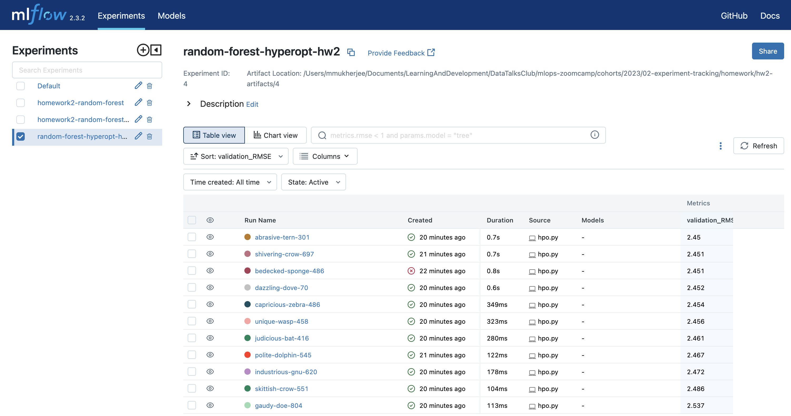
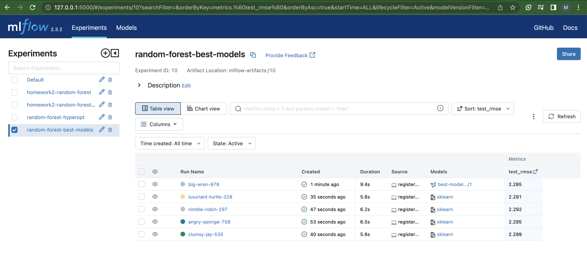

- Data

Reference: https://www.nyc.gov/site/tlc/about/tlc-trip-record-data.page

  - data/green_tripdata_2022-01.parquet
  - data/green_tripdata_2022-02.parquet
  - data/green_tripdata_2022-03.parquet

Process data:

  - train.pkl
  - val.pkl
  - test.pkl

## Q2. Download and preprocess the data

```
python preprocess_data.py --raw_data_path <TAXI_DATA_FOLDER> --dest_path ./output
```

## Q3. Train a model with autolog
```
python train.py --data_path ../data/output
```

###   Generated Logs

```
2023/05/23 17:16:17 INFO mlflow.tracking.fluent: Experiment with name 'homework2-random-forest' does not exist. Creating a new experiment.
2023/05/23 17:16:17 INFO mlflow.tracking.fluent: Autologging successfully enabled for sklearn.
2023/05/23 17:16:28 WARNING mlflow.utils.autologging_utils: MLflow autologging encountered a warning: "/Users/mmukherjee/Documents/LearningAndDevelopment/DataTalksClub/mlops-zoomcamp/cohorts/2023/02-experiment-tracking/venv_02/lib/python3.9/site-packages/_distutils_hack/__init__.py:33: UserWarning: Setuptools is replacing distutils."

run_id: 1abae645111f47c1801292d10bea4716
artifacts: ['model/MLmodel', 'model/conda.yaml', 'model/model.pkl', 'model/python_env.yaml', 'model/requirements.txt']
params: {'bootstrap': 'True', 'max_depth': '10', 'max_samples': 'None', 'min_weight_fraction_leaf': '0.0', 'max_leaf_nodes': 'None', 'min_samples_leaf': '1', 'random_state': '0', 'min_impurity_decrease': '0.0', 'verbose': '0', 'n_estimators': '100', 'criterion': 'squared_error', 'oob_score': 'False', 'ccp_alpha': '0.0', 'warm_start': 'False', 'max_features': '1.0', 'n_jobs': 'None', 'min_samples_split': '2'}
metrics: {'training_score': 0.2905920668431764, 'training_root_mean_squared_error': 1.9456616836464489, 'training_r2_score': 0.2905920668431764, 'training_mean_absolute_error': 1.4846553814437824, 'training_mean_squared_error': 3.785599387209934}
tags: {'estimator_class': 'sklearn.ensemble._forest.RandomForestRegressor', 'estimator_name': 'RandomForestRegressor'}
```

### Launch the tracking server locally for MLflow

```
mlflow ui
```

```
mlflow ui --backend-store-uri sqlite:///hw2-mlflow.db --default-artifact-root artifacts
```

  - Artifacts
```
mlflow ui --backend-store-uri sqlite:///hw2-mlflow.db --default-artifact-root hw2-artifacts

hpo.py
preprocess_data.py
register_model.py
mlruns
train.py
hw2-artifacts
mlartifacts
hw2-mlflow.db
```

## Q4. Tune model hyperparameters
```
python hpo.py --data_path ../data/output --num_trials 10
```

### Logs 

```
[I 2023-05-23 21:51:57,071] A new study created in memory with name: no-name-af5e6d7d-7114-4fbb-bf61-28605d010daa
[I 2023-05-23 21:51:57,947] Trial 0 finished with value: 2.451379690825458 and parameters: {'n_estimators': 25, 'max_depth': 20, 'min_samples_split': 8, 'min_samples_leaf': 3}. Best is trial 0 with value: 2.451379690825458.
[I 2023-05-23 21:51:58,084] Trial 1 finished with value: 2.4667366020368333 and parameters: {'n_estimators': 16, 'max_depth': 4, 'min_samples_split': 2, 'min_samples_leaf': 4}. Best is trial 0 with value: 2.451379690825458.
[I 2023-05-23 21:51:58,824] Trial 2 finished with value: 2.449827329704216 and parameters: {'n_estimators': 34, 'max_depth': 15, 'min_samples_split': 2, 'min_samples_leaf': 4}. Best is trial 2 with value: 2.449827329704216.
[I 2023-05-23 21:51:59,115] Trial 3 finished with value: 2.460983516558473 and parameters: {'n_estimators': 44, 'max_depth': 5, 'min_samples_split': 3, 'min_samples_leaf': 1}. Best is trial 2 with value: 2.449827329704216.
[I 2023-05-23 21:51:59,475] Trial 4 finished with value: 2.453877262701052 and parameters: {'n_estimators': 22, 'max_depth': 11, 'min_samples_split': 5, 'min_samples_leaf': 2}. Best is trial 2 with value: 2.449827329704216.
[I 2023-05-23 21:51:59,664] Trial 5 finished with value: 2.4720122094960733 and parameters: {'n_estimators': 35, 'max_depth': 3, 'min_samples_split': 4, 'min_samples_leaf': 2}. Best is trial 2 with value: 2.449827329704216.
[I 2023-05-23 21:52:00,267] Trial 6 finished with value: 2.4516421799356767 and parameters: {'n_estimators': 28, 'max_depth': 16, 'min_samples_split': 3, 'min_samples_leaf': 3}. Best is trial 2 with value: 2.449827329704216.
[I 2023-05-23 21:52:00,390] Trial 7 finished with value: 2.5374040268274087 and parameters: {'n_estimators': 34, 'max_depth': 1, 'min_samples_split': 7, 'min_samples_leaf': 1}. Best is trial 2 with value: 2.449827329704216.
[I 2023-05-23 21:52:00,727] Trial 8 finished with value: 2.455971238567075 and parameters: {'n_estimators': 12, 'max_depth': 19, 'min_samples_split': 10, 'min_samples_leaf': 4}. Best is trial 2 with value: 2.449827329704216.
[I 2023-05-23 21:52:00,844] Trial 9 finished with value: 2.486106021576535 and parameters: {'n_estimators': 22, 'max_depth': 2, 'min_samples_split': 8, 'min_samples_leaf': 2}. Best is trial 2 with value: 2.449827329704216.
```



## Q5. Promote the best model to the model registry

```
python register_model.py --data_path ../data/output
```

