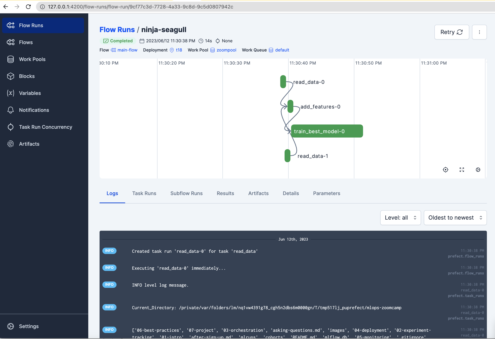

## Homework3: 03-Orchestration using Prefect

Step1: Prefect project initialization 
(venv_prefect) ➜  mlops-zoomcamp git:(main) ✗ prefect project init

Step2: Deployment
(venv_prefect) ➜  mlops-zoomcamp git:(main) ✗ prefect deploy cohorts/2023/03-orchestration/orchestrate.py:main_flow -n t18 -p zoompool

Step3: Trigger Run from UI

